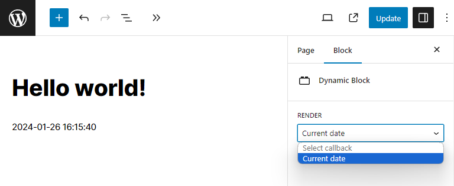

# WordPress Dynamic Block

This WordPress plugin adds a [dynamic block](https://developer.wordpress.org/block-editor/how-to-guides/block-tutorial/creating-dynamic-blocks/) which renders an output of a selected php callback function added via a [filter hook](https://developer.wordpress.org/plugins/hooks/filters/).

## Usage

Add `piotrpress/dynamic_block/callbacks` filter.

## Example

```php
add_filter( 'piotrpress/dynamic_block/callbacks', function( $callbacks ) {
    $callbacks[ 'Current date' ] = function() { return date('Y-m-d H:i:s'); };
    return $callbacks;
} );
```

## Screenshot



## Requirements

PHP >= `7.4` version.

## License

[GPL v3 or later](license.txt)